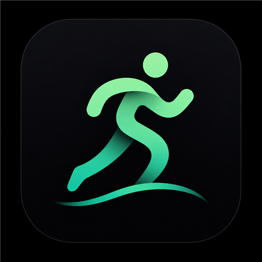
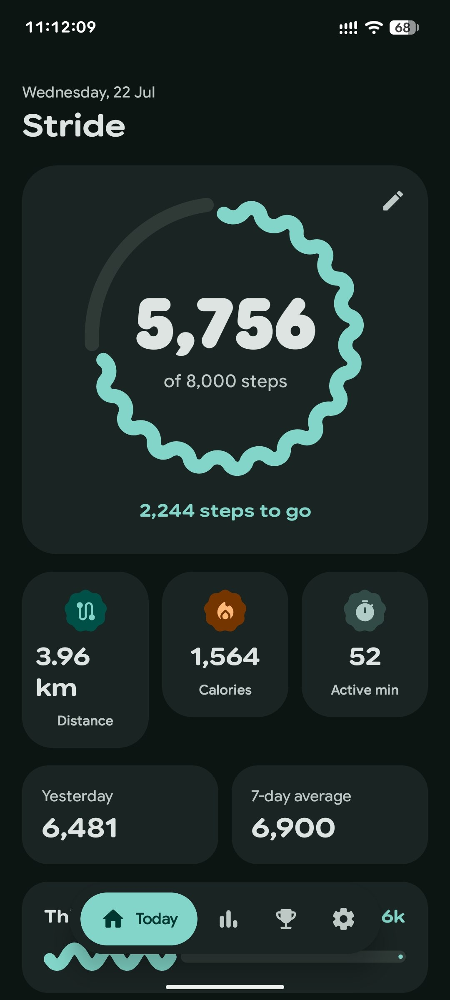
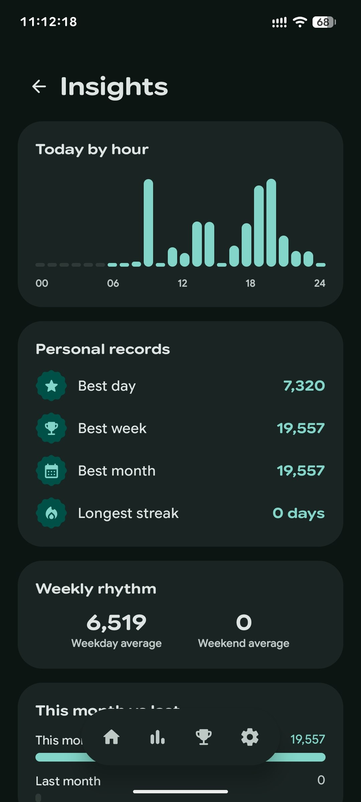
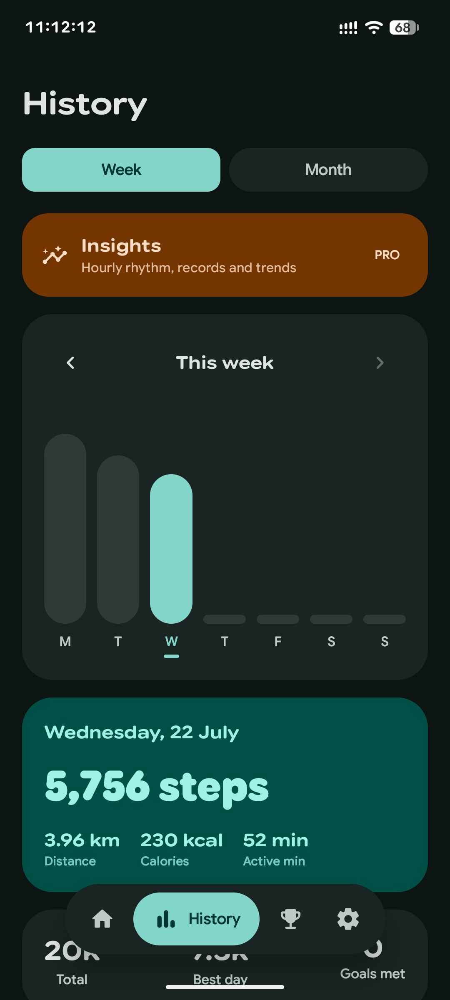
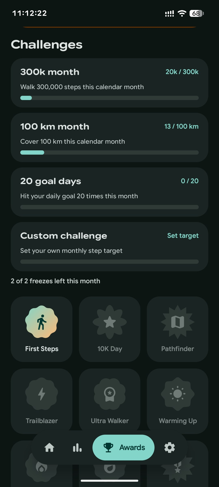
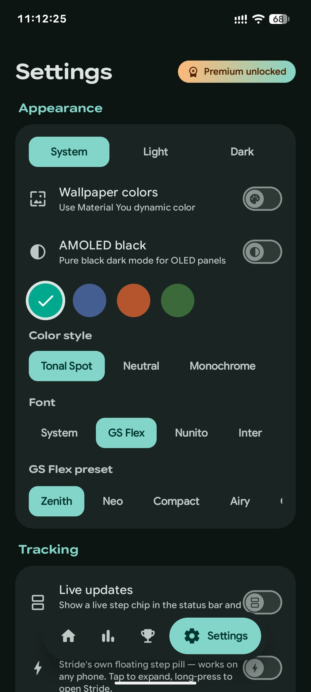

<p align="center">
  
</p>

<h1 align="center">Stride</h1>

<p align="center">
  <b>A step counter that respects your attention.</b><br>
  Material 3 Expressive, written in Kotlin and Jetpack Compose.<br>
  No ads, no account, no analytics — your steps never leave your device.
</p>

<p align="center">
  <a href="https://github.com/NikhilKain/stride/releases/latest"></a>
  
  
</p>

<p align="center">
  
  
  
  
  
</p>

<p align="center">
  <sub><i>Some shots are from the paid edition — see <a href="#editions">Editions</a>.</i></sub>
</p>

---

## Why another step counter?

Most of them want a login, a subscription, and permission to sell your movement
data to whoever asks. Stride wants none of that. It counts your steps, draws them
beautifully, and otherwise leaves you alone.

It reads from **Health Connect** when you allow it and falls back to the phone's
hardware step counter when you don't — so it works on day one whether or not you
use any other fitness app. The two sources are merged by taking whichever saw
more steps, never by adding them, so nothing is ever double-counted.

## What's inside

🚶 **Counting that actually works.** A foreground service keeps counting with the
screen off and survives a reboot. The hardware counter does the work in silicon,
so the battery cost is close to nothing.

📊 **A dashboard worth opening.** A wavy ring that fills as you walk, an odometer
that rolls digit by digit, and distance, calories and active minutes underneath.
Distance uses a stride length calibrated from your height, not a guess.

📅 **History you can read at a glance.** A weekly bar chart and a monthly calendar
heatmap, with any day tappable for the detail.

🏅 **Streaks and 14 achievements**, each a morphing Material shape rather than
another gold star — from *First Steps* to *Ultra Walker* at 30,000 in a day.

🔔 **Live Updates on Android 16.** A promoted ongoing notification puts your
progress in the status bar. Support is patchy across manufacturers, so the app
tells you honestly whether your ROM renders it instead of quietly doing nothing.

🖼️ **Share cards.** Renders your day as a 1080×1350 image, gradient and all,
ready for wherever you post things.

🎨 **Theming, seriously.** Light, dark, system, or pure-black AMOLED. Material You
wallpaper colours. Four palettes, five colour styles, and six bundled variable
fonts you can actually tell apart.

💾 **Backups that are just a file.** Everything exports to a single JSON you can
read, keep, and import on another phone. No cloud in the middle.

🌐 **English and Hindi**, with an in-app language picker.

## Install

Grab the APK from [Releases](https://github.com/NikhilKain/stride/releases/latest).
Android 8.0 or newer.

On first launch Stride asks for **Physical activity** — it genuinely cannot count
steps without it. Notifications are optional, and only used for the ongoing
counter and goal nudges.

## Build it yourself

You need **JDK 17** and the Android SDK with **API 36**.

```bash
git clone https://github.com/NikhilKain/stride
cd stride
./gradlew assembleDebug
```

The wrapper fetches the right Gradle, so that's the whole setup. Your APK lands in
`app/build/outputs/apk/debug/`.

If Gradle can't find your SDK, point it there:

```properties
# local.properties
sdk.dir=/path/to/Android/Sdk
```

## Under the hood

| | |
|---|---|
| Language | Kotlin |
| UI | Jetpack Compose, Material 3 Expressive (`1.5.0-alpha17`) |
| Data | Health Connect, Room, DataStore |
| Background | Foreground service, WorkManager |
| Min / target SDK | 26 / 36 |

Material 3 Expressive is pinned to an alpha deliberately — the wavy progress
indicators, shape morphing and `MotionScheme` this UI leans on aren't in the
stable release yet.

## Editions

Stride is developed **open-core**. This repository is the open-source edition: a
complete, genuinely usable step counter with nothing time-limited, nagged, or
switched off to upsell you.

A separate paid edition adds a GPS walk tracker with maps, deeper insights, a
home-screen widget and a few conveniences on top. Everything in this repository —
tracking, history, achievements, theming, backups — is free and stays that way.

## Contributing

Issues and pull requests are welcome. Because a paid edition shares this codebase,
contributions need a short copyright assignment before they can be merged — open
an issue first and we'll sort it out there.

## Credits

The bundled typefaces — Nunito, Inter, Outfit, Lexend, Manrope and Space Grotesk —
are used under the [SIL Open Font License](https://scripts.sil.org/OFL).

## Licence

[GNU General Public License v3.0](LICENSE)

Stride is free software: redistribute and modify it under the terms of the GPL.
It comes with no warranty.
